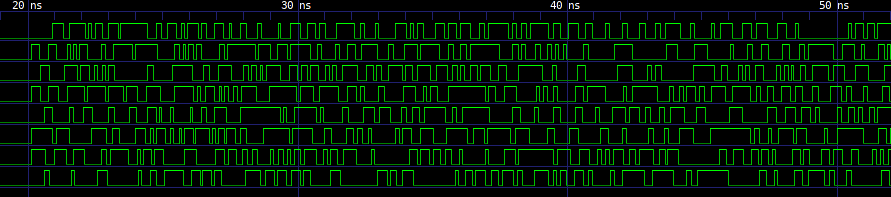
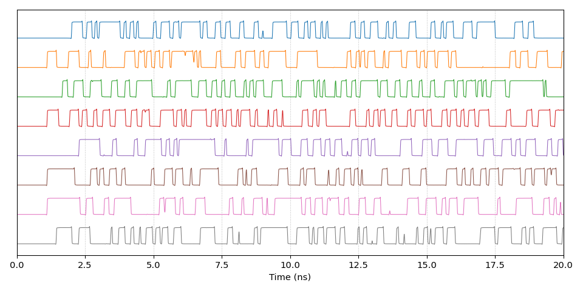
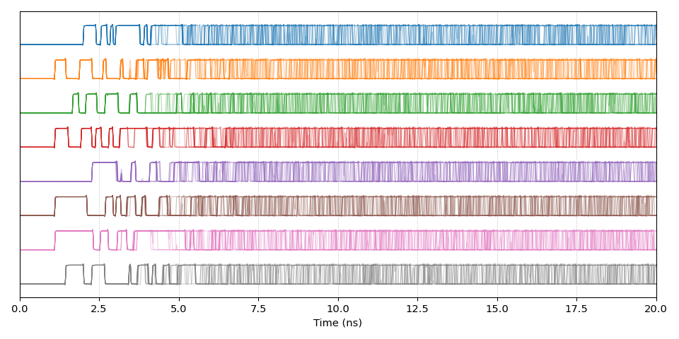
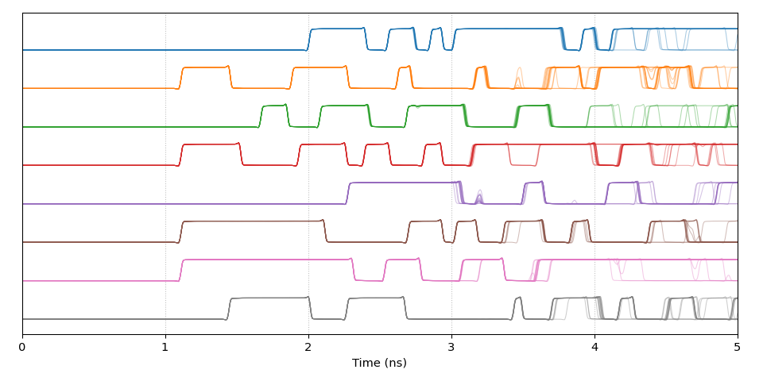

Digital vs analog simulation of the entropy source
==================================================

Digital simulation
------------------

If we try to simulate the entropy source in a standard digital simulator, with
appropriate time delays, we get waveforms that look like this:

While this gives us an idea of what is happening, these results are not accurate
at all, because digital simulators can't reproduce the subtle effects such as
glitches and pulse shrinking that play a crucial role in turning tiny amounts of
jitter into large-scale observable random bits. In order to capture these
effects, we need to use an analog circuit simulator.

Analog simulation
-----------------

I have created an analog transistor-level model of the entropy source in the
form of a SPICE netlist, which can be found in the `analog` folder. Note that
this model is just meant for illustrative purposes and doesn't accurately model
what happens inside an FPGA (for example, the model uses simple CMOS logic gates
that would typically be used in ASICs, rather than the LUTs that are used in
FPGAs, and the model uses 45nm transistors whereas modern FPGAs use 28nm and
smaller). In order to make this model accessible to anyone, I have used the
open-source [ngspice](https://ngspice.sourceforge.io/) simulator rather than a
commercial closed-source simulator. Unfortunately ngspice has only very
rudimentary transient noise support, so the thermal noise simulation is very
crude and really only suitable for illustrative purposes.

If we run this simulation once, we get a waveform that looks like this (the
reset signal is deasserted at t=1ns):

The result looks quite similar, however it contains various small glitches that
were missing in the digital simulation. Things get much more interesting though
if we run the analog simulation multiple times, starting from the same initial
state, but with different thermal noise in each simulation run. The following
plot shows the results of 16 simulations superimposed on one another:

We can see that all simulations start from the exact same initial state, and
initially produce seemingly identical waveforms. However after a short time the
waveforms start to diverge, and after 10ns the waveforms look completely
different. If we zoom in on the first 5ns of the simulation, we can see how
small amounts of jitter can cause large glitches to appear or disappear:

