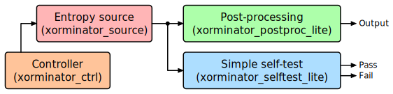
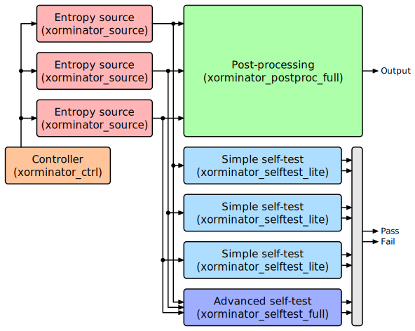

Xorminator Architecture
=======================

There are two xorminator variants: `xorminator_lite` and `xorminator_full`.
These variants are based on the same entropy source, but the 'full' variant
uses multiple instances of the entropy source, uses a cryptographically secure
postprocessing algorithm and contains a more extensive self-test.

Both variants use three basic building blocks:
- Entropy source (`xorminator_source`): This is the block that generates true
randomness. Each entropy source outputs eight 'raw' random bits each clock
cycle, which are derived from thermal noise inside the FPGA. These bits are
'true random' in the sense that they are non-deterministic, but they are biased:
some output values are more likely than others, so these raw bits should never
be used directly.
- Post-processing (`xorminator_postproc_*`): This block takes the raw random
bits from the entropy source and compresses them into a smaller number of
high-quality (unbiased) true random output bits.
- Self-test (`xorminator_selftest_*`): This block checks the raw random bits
produced by the entropy sources and attempts to verify that they are indeed
random. In practice this is a fairly difficult thing to check, so subtle issues
with the entropy source may go undetected, but major failures are easy to
detect.

The following block diagram shows the architecture of `xorminator_lite`:

The following block diagram shows the architecture of `xorminator_full`:

Entropy source
--------------

The entropy source is a chaotic oscillator which is intentionally designed to be
nondeterministic. Thermal noise inside the FPGA produces tiny variations in the
propagation delay of logic gates, known as jitter. This jitter introduces small
perturbations in the state of the oscillator, which due to its chaotic nature
are amplified over time and result in drastically different outcomes. Even when
the oscillator is started from the same initial state multiple times, it will
experience different thermal noise each time, which will cause it to rapidly
diverge and produce a completely different waveform.

The oscillator has a reset signal that can be used to shut it down when not in
use, which saves power and ensures that the oscillator always starts from a
well-defined initial state. Once the oscillator is released from reset, its
state is sampled once per clock cycle to produce 'raw' random bits. In my tests,
this oscillator diverges so fast that its state is essentially random just two
clock cycles after it has been released from reset, and from that point on there
is very little correlation between successive samples.

The following block diagram shows the architecture of the entropy source:

The state transfer function of the oscillator (ignoring reset) is:

    X'[0] = X[1] xor X[2] xor mux(X[4], X[5], C0) xor 0
    X'[1] = X[0] xor X[3] xor mux(X[5], X[4], C1) xor C1
    X'[2] = X[3] xor X[0] xor mux(X[6], X[7], C2) xor 0
    X'[3] = X[2] xor X[1] xor mux(X[7], X[6], C3) xor C3
    X'[4] = X[5] xor X[6] xor mux(X[0], X[1], C4) xor 0
    X'[5] = X[4] xor X[7] xor mux(X[1], X[0], C5) xor C5
    X'[6] = X[7] xor X[4] xor mux(X[2], X[3], C6) xor 1
    X'[7] = X[6] xor X[5] xor mux(X[3], X[2], C7) xor not C7

This function has no fixed points (i.e. no stable states) regardless of the
values of C0 to C7. This was verified exhaustively (see `source_validation.py`).

To see how this oscillator behaves in simulation, take a look at the [analog simulation results](analog-simulation.md). For characterization results on actual hardware, take a look at the [characterization on a Xilinx Artix 7 XC7A100T FPGA](characterization-xilinx-artix7-xc7a100t.md).

The layout of the LUTs and flip-flops of the oscillator and the sampling circuit is important, so fixed placement and pin mapping is used to make the placement and routing predictable and as short as possible, taking into account the specific architecture of the FPGA.

In the device view, the layout looks like this:

The same layout with routing shown:

The highlighted (white) nets correspond to the internal wires of the oscillator.

Post-processing
---------------

TODO

Self-test
---------

TODO

More information about the self-test implementation can be found [here](trng-testing.md)
