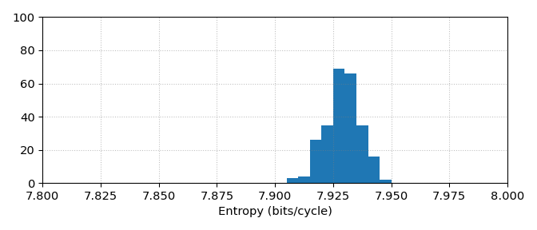
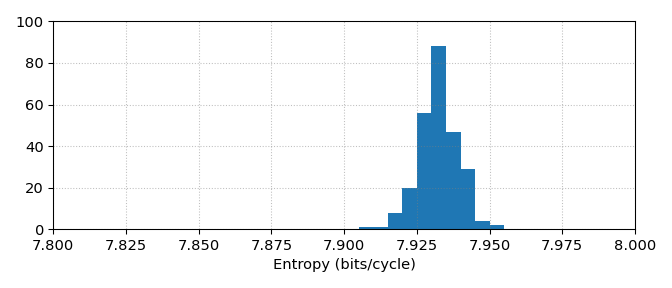
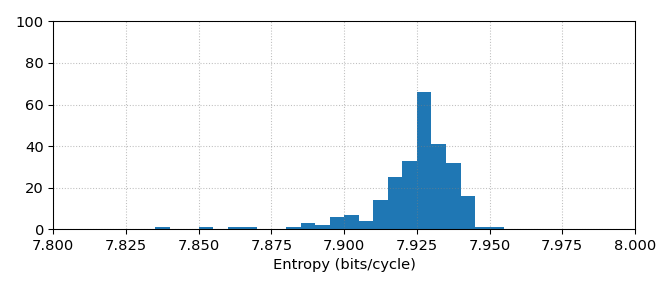

Hardware
========

- FPGA: Xilinx Artix 7 XC7A100T
- Package: CSG324
- Speed grade: 2C
- Board: ZTEX USB-FPGA module 2.13d
- Clock frequencies: 8, 48 and 192 MHz

Characterization results were obtained by placing 256 instances of the
xorminator core in a grid pattern and collecting 256MB of raw output from each
instance. The raw output is collected in blocks of 256 bits, which are generated
by repeatedly resetting the xorminator core, discarding the first four cycles of
output after deasserting reset, and then capturing the next 32 cycles of output.
For each instance this is repeated 2^23 times to obtain 256MB of raw data. The
data is then analyzed separately for each instance, and then the minimum,
maximum, mean and standard deviation across these 256 instances is reported
below.

Summarized results
==================

At 8 MHz clock frequency
------------------------

| (unit: bits/cycle)                          | Min      | Max      | Mean     | Std      |
| ------------------------------------------- | -------- | -------- | -------- | -------- |
| Ideal entropy                               | 8        | 8        | 8        | 0        |
| Entropy lost due to bit-level bias          | 0.044079 | 0.087838 | 0.063194 | 0.006692 |
| Entropy lost due to inter-bit correlation   | 0.000797 | 0.002518 | 0.001208 | 0.000380 |
| Entropy lost due to inter-cycle correlation | 0.000736 | 0.000972 | 0.000854 | 0.000039 |
| Entropy lost due to periodic correlation    | 0.001700 | 0.014763 | 0.005682 | 0.002939 |
| Remaining entropy                           | 7.906432 | 7.948681 | 7.929062 | 0.007457 |

At 48 MHz clock frequency
-------------------------

| (unit: bits/cycle)                          | Min      | Max      | Mean     | Std      |
| ------------------------------------------- | -------- | -------- | -------- | -------- |
| Ideal entropy                               | 8        | 8        | 8        | 0        |
| Entropy lost due to bit-level bias          | 0.044377 | 0.086745 | 0.063295 | 0.006652 |
| Entropy lost due to inter-bit correlation   | 0.000757 | 0.001803 | 0.001085 | 0.000222 |
| Entropy lost due to inter-cycle correlation | 0.000743 | 0.001000 | 0.000856 | 0.000040 |
| Entropy lost due to periodic correlation    | 0.001455 | 0.004551 | 0.002402 | 0.000719 |
| Remaining entropy                           | 7.909390 | 7.950517 | 7.932363 | 0.006790 |

At 192 MHz clock frequency
--------------------------

| (unit: bits/cycle)                          | Min      | Max      | Mean     | Std      |
| ------------------------------------------- | -------- | -------- | -------- | -------- |
| Ideal entropy                               | 8        | 8        | 8        | 0        |
| Entropy lost due to bit-level bias          | 0.045040 | 0.088654 | 0.063629 | 0.006963 |
| Entropy lost due to inter-bit correlation   | 0.000782 | 0.012153 | 0.001665 | 0.001346 |
| Entropy lost due to inter-cycle correlation | 0.000753 | 0.001315 | 0.000878 | 0.000059 |
| Entropy lost due to periodic correlation    | 0.001640 | 0.080376 | 0.009366 | 0.011146 |
| Remaining entropy                           | 7.836605 | 7.950106 | 7.924462 | 0.014653 |

Detailed results for 192 MHz clock frequency
============================================

Raw bit probability and entropy
-------------------------------

This test measures the entropy of each individual bit, not considering
correlations between bits or between consecutive outputs.

The probability of a specific bit being '1' is:

| Bit | Min    | Max    | Mean   | Std    |
| --- | ------ | ------ | ------ | ------ |
| 0   | 0.4384 | 0.4838 | 0.4600 | 0.0095 |
| 1   | 0.4067 | 0.4644 | 0.4386 | 0.0093 |
| 2   | 0.4165 | 0.4624 | 0.4391 | 0.0081 |
| 3   | 0.4367 | 0.4959 | 0.4617 | 0.0109 |
| 4   | 0.4341 | 0.4795 | 0.4580 | 0.0081 |
| 5   | 0.4136 | 0.4598 | 0.4398 | 0.0073 |
| 6   | 0.4199 | 0.4597 | 0.4390 | 0.0073 |
| 7   | 0.4325 | 0.4822 | 0.4583 | 0.0086 |

The corresponding entropy is:

| Bit | Min      | Max      | Mean     | Std      |
| --- | -------- | -------- | -------- | -------- |
| 0   | 0.989018 | 0.999238 | 0.995121 | 0.002191 |
| 1   | 0.974757 | 0.996332 | 0.988832 | 0.003341 |
| 2   | 0.979794 | 0.995912 | 0.989086 | 0.002891 |
| 3   | 0.988408 | 0.999952 | 0.995411 | 0.002393 |
| 4   | 0.987431 | 0.998787 | 0.994707 | 0.001977 |
| 5   | 0.978333 | 0.995342 | 0.989355 | 0.002570 |
| 6   | 0.981389 | 0.995303 | 0.989091 | 0.002598 |
| 7   | 0.986800 | 0.999081 | 0.994768 | 0.002100 |

We can take the sum of these entropy values to estimate the total entropy per
cycle, not considering correlations:

- Min: 7.911346 bits/cycle
- Max: 7.954960 bits/cycle
- Mean: 7.936371 bits/cycle
- Std: 0.006963 bits/cycle

Raw 8-bit word entropy
----------------------

This test measures the entropy of entire 8-bit output words, taking into account
any correlations between bits, but not between consecutive outputs. The test
works by building a histogram of 8-bit output words to estimate the probability
of each output value, from which the entropy is calculated.

- Min: 7.909462 bits/cycle
- Max: 7.952885 bits/cycle
- Mean: 7.934707 bits/cycle
- Std: 0.007194 bits/cycle

(Entropy estimation accuracy: sigma = 6.07e-8 bits/cycle)

Markov chain entropy
--------------------

This test measures the entropy of entire 8-bit output words, taking into account
any correlations between bits, and also any correlation with a limited number of
preceding outputs (depending on the depth of the Markov chain). The test works
by building a histogram of 2 or 3 consecutive 8-bit output words (i.e. 16 or 24
consecutive output bits) to estimate the probability of each sequence of output
values, from which the entropy is calculated.

### Depth 1

- Min: 7.908780 bits/cycle
- Max: 7.952241 bits/cycle
- Mean: 7.934063 bits/cycle
- Std: 0.007198 bits/cycle

(Entropy estimation accuracy: sigma = 9.73e-7 bits/cycle)

### Depth 2

- Min: 7.908458 bits/cycle
- Max: 7.952089 bits/cycle
- Mean: 7.933829 bits/cycle
- Std: 0.007227 bits/cycle

(Entropy estimation accuracy: sigma = 1.57e-5 bits/cycle)

Periodic markov chain entropy
-----------------------------

This test measures the entropy of entire 8-bit output words, taking into account
any correlations between bits and correlation with the previous output, while
also taking into account the position of the output word within the 256-bit
block. The purpose of this test is to detect startup effects and eliminate the
periodic control signal of the xorminator core as a source of false entropy.
This test works by building a histogram of 1 or 2 consecutive 8-bit output words
(i.e. 8 or 16 consecutive output bits) combined with their position in the
256-bit block to estimate the probability of each sequence of output values in
each position, from which the entropy is calculated.

### Depth 1

- Min: 7.837373 bits/cycle
- Max: 7.950774 bits/cycle
- Mean: 7.925179 bits/cycle
- Std: 0.014631 bits/cycle

(Entropy estimation accuracy: sigma = 3.44e-7 bits/cycle)

### Depth 2

- Min: 7.836605 bits/cycle
- Max: 7.950106 bits/cycle
- Mean: 7.924462 bits/cycle
- Std: 0.014653 bits/cycle

(Entropy estimation accuracy: sigma = 5.51e-6 bits/cycle)
