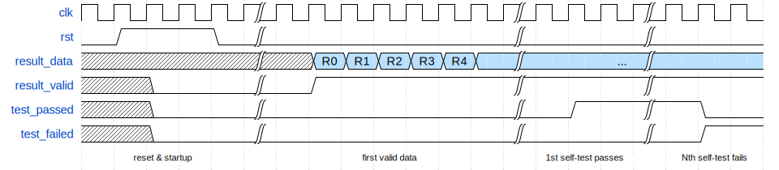

Xorminator Hardware Module (VHDL) Interface
===========================================

This document describes the interface of the `xorminator_lite` and `xorminator_full` hardware modules. The interface is identical except that `result_data` is 4-bit for `xorminator_lite` and 8-bit for `xorminator_full`.

Input and output ports
----------------------

| Port           | Direction | Type       | Size   | Description                                       |
| -------------- | --------- | ---------- | ------ | ------------------------------------------------- |
| `clk`          | input     | bit        | 1      | Clock                                             |
| `rst`          | input     | bit        | 1      | Synchronous reset/powerdown signal, active high   |
| `result_data`  | output    | bit vector | 4 or 8 | Random data output, registered                    |
| `result_valid` | output    | bit        | 1      | Indicates when `result_data` is valid             |
| `test_passed`  | output    | bit        | 1      | Indicates whether the self-test has passed        |
| `test_failed`  | output    | bit        | 1      | Indicates whether the self-test has failed        |

The following timing diagram shows the typical usage of the module:

As long as `rst` is high, the module is powered down to minimize power usage. Once `rst` is lowered, the entropy generator is started, and a short time later `result_valid` goes high to indicate that `result_data` is valid. The startup time is 8 cycles for `xorminator_lite`, and 184 cycles for `xorminator_full`. Any output data produced before `result_valid` goes high should be ignored.

The internal self-test is automatically started once `rst` is lowered. If the self-test completes without detecting any issues, `test_passed` will go high. This takes 8196 cycles for `xorminator_lite` and 792588 cycles for `xorminator_full`. After successful completion, the self-test is automatically restarted and keeps running continuously in the background. If the self-test detects an anomaly, either in the first run or in later runs, `test_failed` goes high immediately and `test_passed` goes low again if it was already high. Test failures are flagged as soon as they are detected, which may be much faster than normal test completion. Once a failure is detected, `test_failed` will stay high and `test_passed` will stay low until the module is reset.

Note that since self-tests are statistical in nature, they can sometimes fail even if the entropy generator is working fine. The detection thresholds have been chosen in such a way that this is extremely rare (at least on the Artix-7 FPGA that I used for testing), but it is still theoretically possible. If you are using a different FPGA, you may need to adjust these thresholds.

Clock frequency
---------------

Note that the performance of the internal entropy source depends somewhat on the clock frequency. This will not affect the output quality as long as the clock frequency is within reasonable bounds, since the post-processing hides the imperfections of the 'raw' bits produced by the entropy source. However for clock frequencies that are either exceptionally high or exceptionally low, the output quality may be affected. The design was extensively tested for clock frequencies between 8 MHz and 192 MHz on an Artix-7 FPGA (more details can be found [here](characterization-xilinx-artix7-xc7a100t.md)) and is known to work correctly in this frequency range for this specific FPGA. If you are going to use the module outside this range, or on a substantially different FPGA, I recommend extensively testing the output quality first. The advanced self-test used by `xorminator_full` should be able to detect quality issues related to excessively low or excessively high clock frequencies.

More information about testing strategies can be found [here](trng-testing.md)
