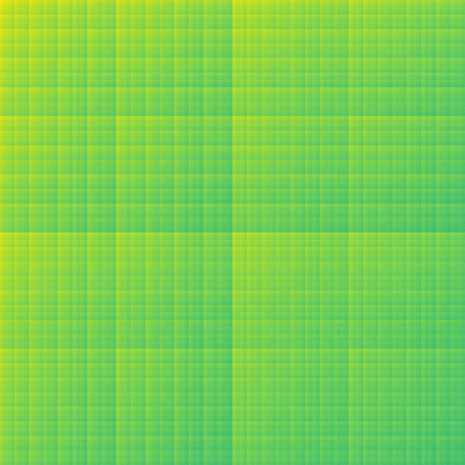
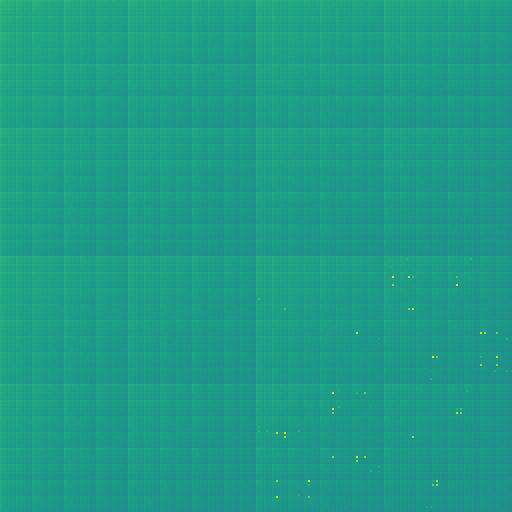
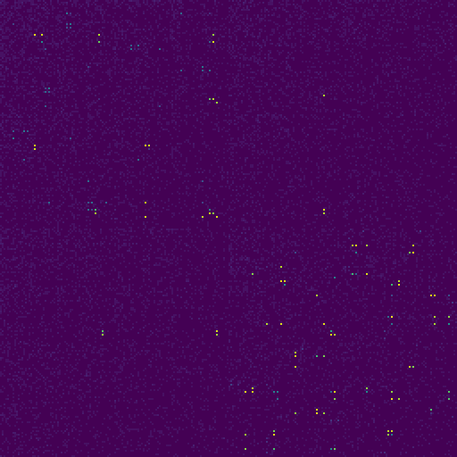

Limit cycles
============

Chaotic oscillators like the one used as the xorminator entropy source usually do not exhibit periodic behavior, because the oscillator contains multiple feedback loops with different periods that all interfere with each other, which makes simple periodic behavior like that of a ring oscillator impossible. However, chaotic oscillators can have so-called [limit cycles](https://en.wikipedia.org/wiki/Limit_cycle) - a form of periodic behavior which can be stable even in the presence of thermal noise. Such limit cycles can act as attractors, meaning that an oscillator which is behaving chaotically may randomly stumble upon a stable limit cycle, and then remain stuck in this stable state. The longer a chaotic oscillator is allowed to run without being reset, the more likely it becomes that it will get stuck in such a limit cycle. This is a problem for true random number generation, because the entropy of the oscillator output drops dramatically when it is stuck in a limit cycle.

For the xorminator oscillator design, limit cycles are not very common, but their rate of occurence varies significantly between multiple instances of the same oscillator design: the majority of instances do not exhibit any limit cycles, some exhibit limit cycles only occasionally (indicating that the limit cycles are not very stable), and some get completely stuck in a limit cycle. If this design was used without any limit cycle mitigations, the entropy source would have a very high failure rate. In order to avoid this, the xorminator oscillator has an additional 8-bit control input, which changes the state transfer function of the oscillator. The transfer function is designed to have no fixed points (i.e. no stable states) regardless of the state of the control input, so the oscillator will oscillate for any control input value, however it will exhibit different limit cycles (if any) for each control input. By driving the control input with a pseudorandom number generator, the oscillator is essentially re-wired every clock cycle, which breaks potential limit cycles.

In theory, limit cycles could still occur when the control input is used, but only if the period of the limit cycle is a multiple of the period of the PRBS. Since the period of the PRBS is much longer than typical limit cycles, this is extremely unlikely to happen.

2D 'Markov' histograms
----------------------

These images are 2D histograms where one axis represents the current 8-bit output and the other axis represents the previous 8-bit output. These histograms are very useful for identifying patterns and correlations between successive output values. They are especially good at detecting limit cycles. Note that the color scale is normalized, so the brightest color corresponds to the bin with the highest count, which is different for each image. This means the same color doesn't necessarily represent the same counts for different images.

The following example images were generated by running the xorminator entropy source on a Xilinx Artix 7 XC7A100T FPGA with the control input intentionally tied to a fixed value.

Here's an example of a good entropy source that exhibits no limit cycles at all (the tile-like pattern is due to bias in the output bits):

Here's another slightly worse entropy source that is occasionally attracted to an unstable limit cycle. Note the dots in the lower-right quadrant:

And here's a bad entropy source that is completely stuck in a very stable limit cycle almost all the time:

When the control input is driven by a simple PRBS, these limit cycles disappear completely, even when the period of the PRBS is taken into account and only samples corresponding to the same control value are selected.
